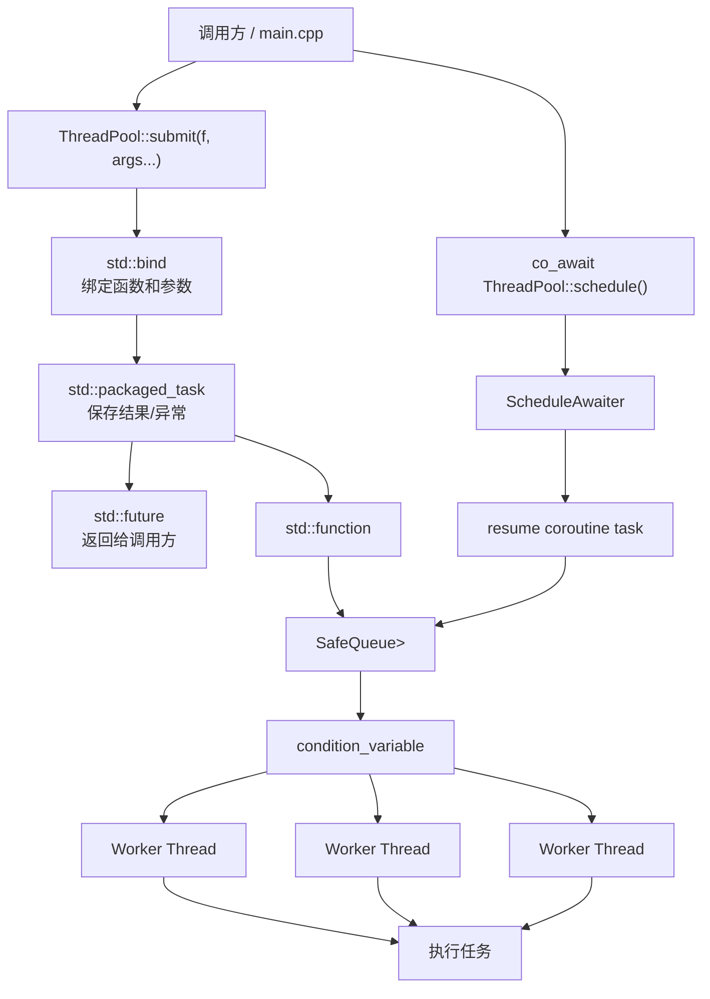

# ThreadPool

一个用于学习 C++ 并发编程的线程池示例项目。项目从最小线程池出发，展示任务队列、worker 线程、`std::future` 结果返回，以及 C++20 协程如何调度到线程池执行。

更完整的设计说明见：[docs/DESIGN.md](docs/DESIGN.md)。

## 项目意义

这个项目不是为了替代成熟的生产级并发库，而是用较小的代码量串起 C++ 并发里的核心概念：

- `SafeQueue`：线程安全任务队列
- `ThreadPool`：管理 worker 线程和任务调度
- `std::condition_variable`：让空闲 worker 休眠，并在新任务到来时唤醒
- `std::packaged_task`：封装任务并保存返回值或异常
- `std::future`：让调用方等待并获取异步任务结果
- C++20 coroutine：用 `co_await pool.schedule()` 把协程恢复到线程池 worker 上
- `wait_idle()`：等待队列任务和正在执行的任务全部完成
- `ShutdownMode`：支持优雅排空和取消排队任务两种关闭策略
- `StopSource` / `StopToken`：支持任务内部协作式取消

## 项目结构

```text
.
├── CMakeLists.txt        # CMake 构建入口
├── SafeQueue.h           # 线程安全队列
├── ThreadPool.h          # 线程池实现
├── main.cpp              # 示例程序
├── test.cpp              # C++14 基础行为测试
├── test_coroutine.cpp    # C++20 协程调度测试
└── stress_test.cpp       # 压力测试
```

## 架构



## 如何构建和测试

推荐使用 CMake：

```powershell
cmake -S . -B build
cmake --build build
ctest --test-dir build --output-on-failure
```

也可以直接用 g++ 编译：

```powershell
g++ -std=gnu++14 -Wall -Wextra -Wpedantic -pthread main.cpp -o threadpool_check.exe
g++ -std=gnu++14 -Wall -Wextra -Wpedantic -pthread test.cpp -o threadpool_tests.exe
g++ -std=gnu++20 -Wall -Wextra -Wpedantic -pthread test_coroutine.cpp -o threadpool_coroutine_tests.exe
g++ -std=gnu++14 -Wall -Wextra -Wpedantic -pthread stress_test.cpp -o threadpool_stress.exe
```

运行：

```powershell
.\threadpool_check.exe
.\threadpool_tests.exe
.\threadpool_coroutine_tests.exe
.\threadpool_stress.exe
```

压力测试支持传参：

```powershell
.\threadpool_stress.exe <tasks> <workers> <submitters>
```

例如：

```powershell
.\threadpool_stress.exe 50000 8 8
```

## 基本用法

创建线程池后可以直接提交任务，构造函数会自动启动 worker 线程：

```cpp
threadpool::ThreadPool pool(3);

auto result = pool.submit([] {
	return 42;
});

std::cout << result.get() << std::endl;
```

`submit()` 返回 `std::future<T>`。如果任务还没完成，`future.get()` 会等待；如果任务抛出异常，异常会在 `future.get()` 时重新抛出。

## 如何传递任务

传普通函数：

```cpp
int add(int a, int b)
{
	return a + b;
}

threadpool::ThreadPool pool(3);
auto result = pool.submit(add, 1, 2);
std::cout << result.get() << std::endl;
```

传 lambda：

```cpp
auto result = pool.submit([](int a, int b) {
	return a * b;
}, 5, 6);
```

传引用参数时需要使用 `std::ref`：

```cpp
void multiply_output(int &out, int a, int b)
{
	out = a * b;
}

int output = 0;
auto done = pool.submit(multiply_output, std::ref(output), 5, 6);
done.get();
```

传成员函数：

```cpp
class Calculator {
public:
	int multiply(int a, int b)
	{
		return a * b;
	}
};

Calculator calc;
auto result = pool.submit(&Calculator::multiply, &calc, 4, 5);
```

## submit 的实现思路

`submit()` 的核心目标是把任意形式的任务：

```text
function + args -> return value
```

统一转换成队列可以保存的：

```text
std::function<void()>
```

内部步骤：

1. 使用 `std::result_of` 推导返回类型。
2. 使用 `std::bind` 把函数和参数绑定成无参调用。
3. 使用 `std::packaged_task` 包装任务，让结果可以通过 `future` 获取。
4. 把 `packaged_task` 包成 `std::function<void()>`。
5. 加锁检查线程池是否关闭，并把任务推入 `SafeQueue`。
6. 调用 `notify_one()` 唤醒一个 worker。

可以简单理解为：

```text
bind            负责绑定参数
packaged_task   负责执行并保存结果
future          负责把结果交还给调用方
SafeQueue       负责在线程之间传递任务
```

## 协程支持

C++20 的协程只提供语言机制，例如 `co_await`、`std::coroutine_handle`、挂起和恢复。标准库本身不提供线程池、事件循环或任务调度器。

本项目提供了一个最小调度入口：

```cpp
co_await pool.schedule();
```

它的含义是：

1. 当前协程挂起。
2. 把协程的 `resume()` 封装成任务提交到线程池。
3. worker 线程执行该任务。
4. 协程在线程池 worker 上继续运行。

示例：

```cpp
CoroutineTask work(ThreadPool &pool)
{
	co_await pool.schedule();

	// 从这里开始运行在线程池 worker 线程中
	do_heavy_work();
}
```

这里不是重新实现协程，而是使用 C++20 自带协程机制，并给它补上“在哪里恢复执行”的调度策略。

## 关闭语义

默认的 `shutdown()` 使用 `ShutdownMode::Drain`，会：

1. 停止接收新任务。
2. 唤醒所有等待中的 worker。
3. 执行完队列中已经提交的任务。
4. `join` 所有 worker 线程。

如果希望尽快关闭，可以使用：

```cpp
pool.shutdown(ThreadPool::ShutdownMode::CancelPending);
```

这个模式会丢弃还没有被 worker 取走的排队任务，已经开始执行的任务仍会执行完成。被丢弃任务对应的 `future.get()` 会抛出 `std::future_error`，因为其 `packaged_task` 没有机会执行。

如果在线程池关闭后继续调用 `submit()`，会抛出 `std::runtime_error`。

析构函数会自动调用 `shutdown()`，因此忘记手动关闭时也能安全回收线程。

## 运行时状态

线程池提供了几个查询和同步接口，方便测试或上层业务做可观测性控制：

```cpp
pool.wait_idle();       // 等待队列为空且没有正在执行的任务
pool.wait_idle_for(std::chrono::seconds(1)); // 在超时时间内等待空闲
pool.worker_count();    // worker 线程数量
pool.queued_tasks();    // 当前排队任务数量
pool.active_tasks();    // 当前正在执行的任务数量
pool.is_shutdown();     // 是否已经进入关闭状态
```

构造线程池时 worker 数量不能为 0：

```cpp
ThreadPool pool(0); // 抛出 std::invalid_argument
```

## 协作式取消

线程池无法安全地强行杀死正在运行的 C++ 线程。更生产化的做法是协作式取消：任务定期检查 `StopToken`，发现请求后自己尽快返回。

```cpp
threadpool::ThreadPool pool(2);
threadpool::ThreadPool::StopSource stop_source;

auto result = pool.submit_with_stop(
	stop_source.token(),
	[](threadpool::ThreadPool::StopToken token) {
		while (!token.stop_requested()) {
			do_some_work_chunk();
		}
		return "stopped";
	}
);

stop_source.request_stop();
std::cout << result.get() << std::endl;
```

这和 `ShutdownMode::CancelPending` 是两件事：

- `CancelPending` 只会丢弃还没开始执行的排队任务。
- `StopToken` 用于通知已经开始执行的任务自行退出。

## 适合的使用场景

- 学习 C++ 线程池、条件变量、future 和协程调度
- 把 CPU 密集型任务分发到多个 worker 线程
- 批量处理文件、图片、日志或计算任务
- 在小型工具中把耗时任务放到后台线程
- 演示 C++20 协程如何切换到线程池执行

## 当前边界

这个项目仍然是学习型实现，还没有包含生产级线程池常见能力：

- 任务优先级
- 单个任务级别的超时取消
- 动态扩缩容
- 完整的 `Task<T>` 协程返回值模型
- 系统化性能基准和跨平台 CI
