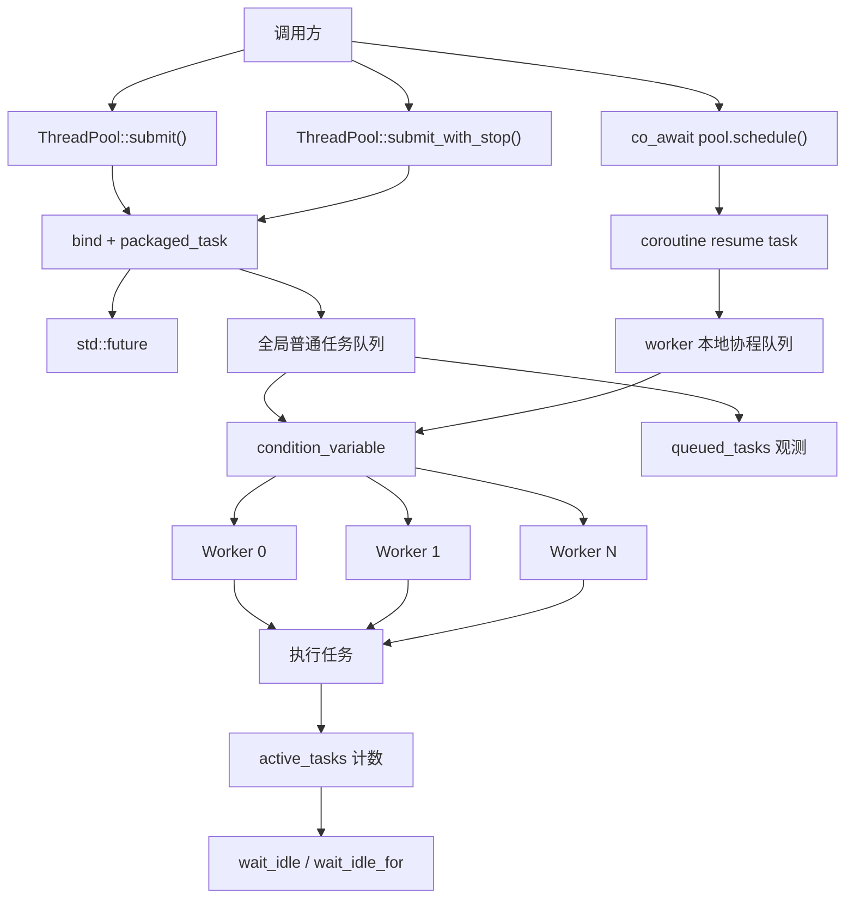
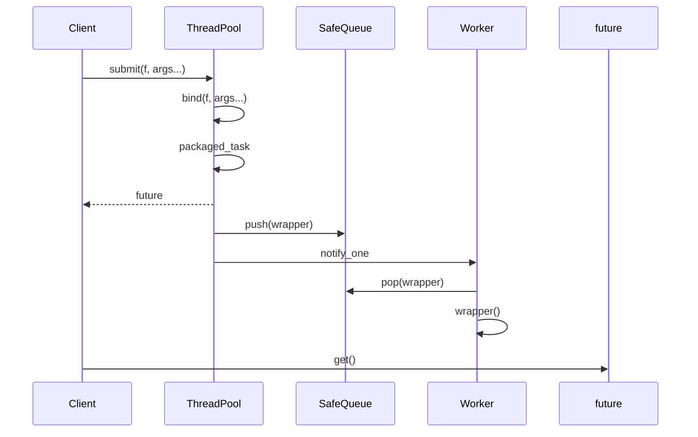
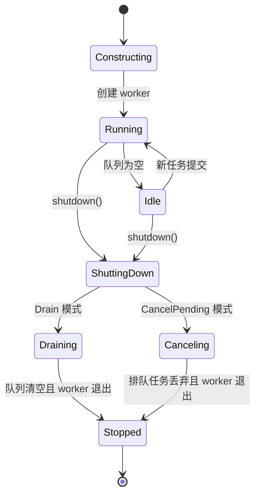
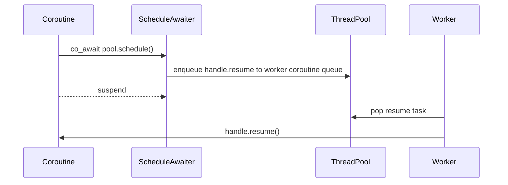

# ThreadPool 详细设计说明

本文档说明当前线程池项目的设计思想、任务调度策略、生命周期管理、协程支持、优点与缺点，以及它距离完整生产级线程池还缺少什么。

## 设计目标

这个项目的目标不是做一个功能最复杂的线程池，而是实现一个结构清晰、可测试、可扩展的小型 C++ 并发组件。

核心目标：

- 使用固定数量 worker 线程复用系统线程资源。
- 支持纯线程模式和线程 + 协程模式切换。
- 支持普通函数、lambda、成员函数和带返回值任务。
- 使用 `std::future` 把异步任务结果返回给调用方。
- 支持优雅关闭和取消尚未执行的排队任务。
- 支持等待线程池空闲，方便测试和业务同步。
- 支持 C++20 协程调度到线程池执行，并支持协程主动让出 worker。
- 提供压力测试和基础 benchmark，观察稳定性、吞吐和调度延迟。
- 保持 C++14 基础接口可用，同时在 C++20 下启用协程能力。

## 总体架构



主要组件：

- `threadpool::ThreadPool`：对外 facade，负责暴露任务提交、关闭、状态查询和协程 awaiter。
- `threadpool::ThreadPoolRuntime`：运行时协调层，负责关闭状态、worker 唤醒、启动关闭流程，以及连接调度器和 worker 组。
- `ExecutionMode`：运行模式，决定线程池是否启用协程调度能力。
- `Options`：线程池启动参数，包含 worker 数量和运行模式。
- `threadpool::SafeQueue<T>`：线程安全队列，保存待执行任务。
- 全局任务队列：保存普通 `submit()` 任务。
- worker 本地协程队列：保存对应 worker 的协程恢复任务。
- `Worker`：内部工作线程对象，循环等待、取任务、执行任务。
- `StopSource` / `StopToken`：协作式取消机制。
- `ScheduleAwaiter`：把协程切换到线程池 worker。
- `YieldAwaiter`：让当前协程主动让出 worker，并重新排队等待恢复。

当前项目采用 header-only 拆分方式，外部仍只需要包含：

```cpp
#include "ThreadPool.h"
```

内部文件职责：

```text
ThreadPool.h           对外主入口、ThreadPool 声明和模板 submit
ThreadPoolRuntime.h    运行时协调层，集中启动、关闭和 worker 唤醒
ThreadPoolRuntimeImpl.h ThreadPoolRuntime inline 实现
TaskScheduler.h        普通任务队列、worker 协程队列、work stealing、空闲等待
ThreadPoolImpl.h       ThreadPool facade 的少量 inline 实现
ThreadPoolSubmit.h     submit / submit_with_stop 模板实现
ThreadPoolWorker.h     ThreadPoolWorker 类型、worker 循环和任务执行逻辑
WorkerGroup.h          worker 生命周期、扩缩容、join 管理
WorkerGroupImpl.h      WorkerGroup 创建 ThreadPoolWorker 的 inline 实现
ThreadPoolOptions.h    关闭模式、运行模式、启动参数
ThreadPoolStopToken.h  协作式取消 token/source
ThreadPoolTypeTraits.h C++14/C++20 类型萃取兼容层
SafeQueue.h            线程安全队列
```

## 任务模型

线程池内部队列只保存一种任务类型：

```cpp
std::function<void()>
```

但调用方可以提交各种形式的任务：

```cpp
pool.submit(add, 1, 2);
pool.submit([] { return 42; });
pool.submit(&Calculator::multiply, &calc, 3, 4);
```

`submit()` 会把这些不同形式统一转换成 `std::function<void()>`。

转换过程：

1. `std::result_of` 推导任务返回类型。
2. `std::bind` 绑定函数和参数，得到无参函数对象。
3. `std::packaged_task<return_type()>` 包装任务。
4. `packaged_task::get_future()` 返回结果通道。
5. 把 `packaged_task` 包进 `std::function<void()>`。
6. 任务入队，并唤醒一个 worker。



这种设计的好处是 worker 不需要知道任务的真实类型、参数列表和返回值类型。worker 只负责执行 `void()`。

## 调度策略

当前线程池使用的是固定线程数、普通任务全局 FIFO 队列、worker 本地协程队列、条件变量唤醒的调度策略。

### 分层职责划分

当前实现按 facade、runtime、scheduler、worker group、worker 执行单元拆分：

`ThreadPool` 负责：

- 提供任务提交、等待空闲、状态查询等对外接口。
- 持有 `ThreadPoolRuntime`，不直接管理任务队列、worker 线程数组和底层锁。
- 提供 `schedule()` / `yield()` 这类协程入口，并转发给 runtime。

`ThreadPoolRuntime` 负责：

- 管理运行时关闭状态、启动状态和 worker 唤醒条件变量。
- 协调 `TaskScheduler`、`WorkerGroup` 和 `ThreadPoolWorker`。
- 在提交任务、协程恢复、关闭线程池时完成跨层调度。
- 给 worker 提供 `wait_for_work()` / `finish_work()` 这样的内部接口，避免 worker 直接访问上层私有字段。

`TaskScheduler` 负责：

- 保存全局普通任务队列。
- 保存 worker 本地协程队列。
- 选择协程初始调度目标 worker。
- 执行 work stealing。
- 维护 active task 计数。
- 判断线程池是否空闲。
- 提供 `wait_idle`、排队任务数、排队协程数等调度状态能力。
- 管理自己的调度状态锁和 idle 条件变量。

`ThreadPoolWorker` 负责：

- 持有所属 runtime 指针和 worker id。
- 等待任务到达或空闲超时。
- 优先执行本地协程恢复任务。
- 回退执行全局普通任务。
- 在空闲时尝试偷取其他 worker 的协程恢复任务。
- 执行任务并更新活跃任务计数。

这样拆分后，pool 更像调度器和资源管理者，worker 更像执行单元。

`WorkerGroup` 负责：

- 保存 worker 线程列表。
- 维护 live worker 数量。
- 分配 worker id。
- 根据队列压力动态创建 worker。
- 处理空闲 worker 是否可以退出。
- 记录已空闲退出的 worker，并在后续扩容前回收对应 thread 对象。
- 在线程池关闭时 join 所有 worker。
- 管理自己的线程容器锁，外部不直接操作线程数组。

拆分后，`ThreadPool` 更像 facade，`ThreadPoolRuntime` 负责“运行时怎么协调”，`TaskScheduler` 负责“任务怎么排”，`WorkerGroup` 负责“线程怎么管”，`ThreadPoolWorker` 负责“线程怎么跑”。

### 锁管理策略

项目采用“谁拥有数据，谁管理锁”的策略：

- `SafeQueue` 内部保护自己的队列 push / pop / size / clear。
- `TaskScheduler` 保护 active task 计数、协程轮询下标和 idle 等待条件。
- `WorkerGroup` 保护 worker 线程数组和已退休 worker 记录。
- `ThreadPoolRuntime` 只保护启动/关闭状态和 worker 唤醒条件。
- `ThreadPoolWorker` 不直接访问任何上层锁，只通过 runtime 方法取任务、完成任务和退出。

这种拆分避免了一个大锁覆盖所有逻辑，也避免底层组件依赖上层对象的私有状态。代价是跨层状态变化需要更明确的通知，例如任务入队后由 runtime 负责唤醒 worker，任务完成后由 scheduler 判断是否进入 idle。

### 运行模式

线程池支持两种运行模式：

```cpp
enum class ExecutionMode {
	ThreadOnly,
	ThreadAndCoroutine
};
```

默认模式是 `ThreadOnly`，只启用普通任务提交和 worker 调度。该模式适合大多数同步函数、lambda、成员函数等普通任务。

如果需要使用 C++20 协程调度，需要显式启用 `ThreadAndCoroutine`：

```cpp
threadpool::ThreadPool pool(
	4,
	threadpool::ThreadPool::ExecutionMode::ThreadAndCoroutine
);
```

也可以使用启动参数对象：

```cpp
threadpool::ThreadPool::Options options;
options.min_workers = 4;
options.max_workers = 4;
options.execution_mode = threadpool::ThreadPool::ExecutionMode::ThreadAndCoroutine;

threadpool::ThreadPool pool(options);
```

这样做的原因是让普通线程池场景保持简单，协程能力作为显式增强项启用，避免调用方误以为所有线程池实例都可以进行协程调度。

### 固定线程数

线程池构造时创建固定数量 worker：

```cpp
threadpool::ThreadPool pool(4);
```

worker 数量不能为 0，否则构造函数抛出 `std::invalid_argument`。

固定线程数的特点：

- 实现简单。
- 线程数量稳定，不会在高峰期无限增长。
- 适合 CPU 密集型任务或可控后台任务。
- 不支持根据负载动态扩缩容。

### 共享 FIFO 队列

普通任务进入全局 `SafeQueue<std::function<void()>>`。

worker 被唤醒后从队列头部取任务执行，因此整体上接近 FIFO。

注意：由于多线程并发执行，任务“开始执行”的顺序接近提交顺序，但任务“完成”的顺序不保证一致。耗时短的任务可能比先提交的长任务更早完成。

### worker 本地协程队列

在线程 + 协程模式下，每个 worker 维护一个本地协程队列：

```text
Worker 0 coroutine queue
Worker 1 coroutine queue
Worker N coroutine queue
```

普通任务仍然进入全局队列，协程恢复任务进入 worker 本地队列。

调度策略：

- `schedule()`：按轮询策略选择一个 worker，并把协程恢复动作放入该 worker 的本地协程队列。
- `yield()`：如果当前协程已经运行在线程池 worker 上，则优先放回当前 worker 的本地协程队列。
- worker 执行任务时，优先检查自己的协程队列，再检查全局普通任务队列。
- worker 连续执行一定数量的协程恢复任务后，会优先检查一次全局普通任务队列，避免普通任务饥饿。
- worker 本地协程队列为空且全局普通任务队列也为空时，会尝试从其他 worker 的协程队列偷取恢复任务。

这个设计让“每个 worker 承载多个协程”的模型更清晰，也为后续实现 worker 本地调度、亲和性和 work stealing 留出空间。

### 条件变量唤醒

当队列为空时，worker 使用 `condition_variable::wait(lock, predicate)` 休眠。

predicate 是：

```cpp
m_shutdown || !m_queue.empty()
```

这样可以处理两类事件：

- 有新任务入队。
- 线程池进入关闭流程。

使用 predicate 的原因：

- 避免虚假唤醒导致 worker 空转。
- 避免通知丢失后 worker 永久睡眠。
- 让关闭状态和任务状态在同一套等待条件中统一处理。

### 唤醒策略

提交一个任务后调用：

```cpp
m_conditional_lock.notify_one();
```

这表示每次新任务只唤醒一个 worker。这样可以减少无意义唤醒，适合常规任务提交。

关闭线程池时调用：

```cpp
m_conditional_lock.notify_all();
```

因为所有 worker 都需要醒来检查关闭状态并退出。

## 生命周期策略

线程池生命周期分为四个阶段：



### 自动启动

构造函数会自动调用 `init()`：

```cpp
threadpool::ThreadPool pool(4);
```

调用方不需要手动启动线程。`init()` 仍保留，并且是幂等的，多次调用不会重复创建 worker。

### 自动关闭

析构函数会调用 `shutdown()`：

```cpp
~ThreadPool() noexcept;
```

这样可以避免调用方忘记关闭线程池时触发 `std::terminate`。

### 关闭模式

当前支持两种关闭模式。

#### Drain

默认模式：

```cpp
pool.shutdown();
```

语义：

- 停止接收新任务。
- 已经提交的任务继续执行。
- 队列排空后 worker 退出。
- 调用方等待所有 worker join。

适合希望不丢任务的场景。

#### CancelPending

立即取消排队任务：

```cpp
pool.shutdown(threadpool::ThreadPool::ShutdownMode::CancelPending);
```

语义：

- 停止接收新任务。
- 清空还没开始执行的普通排队任务。
- 已经开始执行的任务继续运行到结束。
- 被清空任务对应的 `future.get()` 会抛 `std::future_error`。
- 已经挂起并进入 worker 协程队列的协程恢复任务不会被直接清空，避免协程永远无法恢复并导致等待方挂起。

适合程序退出、用户取消批量作业、服务降级等场景。

## 等待空闲策略

线程池维护两个状态：

- `queued_tasks()`：队列中尚未开始执行的任务数。
- `active_tasks()`：worker 已经取出、正在执行的任务数。

当满足下面条件时，线程池视为空闲：

```text
queued_tasks == 0 && active_tasks == 0
```

可以使用：

```cpp
pool.wait_idle();
pool.wait_idle_for(std::chrono::seconds(1));
pool.wait_idle_until(deadline);
```

这些接口适合：

- 单元测试等待后台任务完成。
- 应用退出前等待后台任务收尾。
- 批处理阶段之间做同步。

## 协作式取消策略

C++ 不能安全地强制终止任意正在运行的线程。强杀线程可能导致锁没有释放、对象析构不完整、共享状态损坏。

因此项目采用协作式取消：

```cpp
threadpool::ThreadPool::StopSource stop_source;

auto future = pool.submit_with_stop(
	stop_source.token(),
	[](threadpool::ThreadPool::StopToken token) {
		while (!token.stop_requested()) {
			do_work_chunk();
		}
	}
);

stop_source.request_stop();
```

特点：

- `StopSource` 发出取消请求。
- `StopToken` 被传入任务。
- 任务自己定期检查 `stop_requested()`。
- 任务决定何时安全退出。

这是一种更安全、也更符合 C++ 资源管理模型的取消方式。

## 协程调度策略

C++20 协程本身只提供挂起和恢复机制，不提供线程池或事件循环。

本项目提供：

```cpp
co_await pool.schedule();
```

其含义是：

1. 当前协程挂起。
2. `ScheduleAwaiter::await_suspend()` 得到 `std::coroutine_handle<>`。
3. 按轮询策略选择一个 worker。
4. 把 `handle.resume()` 封装成恢复任务，放入目标 worker 的本地协程队列。
5. worker 执行该恢复任务。
6. 协程从 `co_await` 后的位置继续运行。



这个设计不是重新实现协程，而是利用标准协程机制，补上“在哪里恢复执行”的调度策略。

在协程已经运行到线程池 worker 后，还可以使用：

```cpp
co_await pool.yield();
```

`yield()` 会把当前协程挂起，并把 `resume()` 重新放回当前 worker 的本地协程队列。这样同一个 worker 线程可以在多个协程之间协作式轮转：

```text
Worker 0
  -> resume coroutine A
  -> A yield，重新入队
  -> resume coroutine B
  -> B yield，重新入队
  -> resume coroutine A
```

这种模型仍然是协作式调度，不是抢占式调度。如果某个协程长时间不 `yield`，它仍然会占用当前 worker。

当前协程支持仍然是轻量级的，只提供调度恢复和协作式让出，不提供完整 `Task<T>` 异步组合模型。

如果线程池处于 `ThreadOnly` 模式，调用 `schedule()` 或 `yield()` 会抛出 `std::runtime_error`。这能尽早暴露模式配置错误。

## 线程安全设计

项目中的关键共享状态包括：

- 任务队列。
- shutdown 状态。
- started 状态。
- active task 计数。
- worker 线程数组。

保护策略：

- `SafeQueue` 内部使用自己的 mutex 保护队列。
- `ThreadPool` 使用 `m_conditional_mutex` 保护关闭状态、启动状态和 active task 计数。
- 每个 worker 的协程队列独立加锁，普通任务队列和协程队列分离。
- worker 等待使用 `condition_variable` predicate。
- 任务提交时在锁内检查 `m_shutdown`，避免关闭后继续入队。

需要注意的是，当前实现中队列有自己的锁，线程池也有自己的条件变量锁。这让队列可以独立复用，但也比“队列和条件变量共用一把锁”的实现稍复杂。

## 优点

### 1. 接口简单

最常用接口只有：

```cpp
auto future = pool.submit(task, args...);
```

调用方容易理解。

### 2. 支持返回值和异常传播

通过 `std::packaged_task` 和 `std::future`，任务返回值和异常都能传回调用方。

### 3. 生命周期更安全

构造后自动启动，析构时自动关闭，减少误用成本。

### 4. 支持两种关闭语义

`Drain` 适合不丢任务，`CancelPending` 适合快速退出。

### 5. 支持可观测状态

`queued_tasks()`、`active_tasks()`、`wait_idle()` 让测试和业务同步更容易。

### 6. 支持 C++20 协程调度

可以把协程恢复到线程池 worker 上，方便编写异步流程。

### 7. 有基础测试和压力测试

项目包含：

- 行为测试。
- 协程测试。
- 压力测试。
- 基准测试。

比单纯 demo 更接近可维护组件。

## 缺点与限制

### 1. 没有任务优先级

所有任务都进入同一个 FIFO 队列。紧急任务不能插队。

适合普通后台任务，不适合实时性要求高的调度系统。

### 2. 没有动态扩缩容

worker 数量构造后固定。

如果负载变化很大，固定线程数可能不够灵活。

### 3. 没有 work stealing

所有 worker 共享一个队列。高并发下队列锁可能成为瓶颈。

更复杂的线程池可能会使用每线程本地队列和 work stealing 策略。

### 4. 取消是协作式的

`StopToken` 只能通知任务退出，不能强制停止任务。

如果任务不检查 token，就不会响应取消。

### 5. `CancelPending` 会让 future 变成 broken promise

排队任务被清空后，其 `packaged_task` 不会执行，对应 `future.get()` 会抛 `std::future_error`。

这是合理行为，但调用方必须知道并处理。

### 6. 协程支持还很轻量

当前只有 `schedule()` 和 `yield()`，没有：

- `Task<T>`
- 协程返回值组合
- continuation
- cancellation-aware awaiter
- structured concurrency

### 7. benchmark 仍然比较基础

目前提供了一个基础 benchmark，用于观察不同 worker 数下的任务吞吐和简单延迟采样。但它还不是严格性能评测体系，例如尚未覆盖：

- 和 `std::async` 或其他线程池对比。
- 长时间 soak test。
- CPU 亲和性、系统负载隔离和统计置信区间。
- 不同任务粒度、不同队列策略下的系统化对比。

运行方式：

```powershell
.\threadpool_benchmark.exe <tasks> <submitters>
```

输出指标：

- `tasks/sec`：单位时间完成的任务数。
- `p50_us` / `p95_us` / `p99_us`：任务从提交到开始执行的延迟采样。

benchmark 没有加入默认 CTest。功能正确性由单元测试、协程测试和压力测试覆盖；benchmark 主要用于人工观察不同配置下的性能趋势。

## 纯线程模式与线程 + 协程模式对比

项目提供 `mode_compare.cpp`，用于对比两种模式：

- `ThreadOnly`：提交普通任务，由 worker 直接取出并执行。
- `ThreadAndCoroutine`：启动多个协程，协程切换到 worker 后多次 `yield`，观察协作式轮转成本。

运行方式：

```powershell
.\threadpool_mode_compare.exe <tasks> <coroutines> <yields_per_coroutine> <workers>
```

示例：

```powershell
.\threadpool_mode_compare.exe 20000 2000 10 4
```

对比指标：

- `operations`：完成的普通任务数，或协程中的 yield 步骤加最终完成步骤。
- `ms`：总耗时。
- `ops/sec`：每秒完成操作数。

需要注意的是，两种模式衡量的不是完全相同的工作负载。纯线程模式偏向“任务吞吐”；线程 + 协程模式偏向“协程挂起、重新排队、恢复执行”的调度开销观察。协程模式的优势通常体现在复杂异步流程、等待型任务和大量轻量执行单元，而不是极短 CPU 空任务。

## 适合场景

适合：

- 学习 C++ 并发和线程池原理。
- 小型工具的后台任务执行。
- CPU 密集型批处理。
- 测试环境中的异步任务调度。
- 需要 `future` 返回值的简单并行任务。
- 演示 C++20 协程如何切换到线程池执行。

不适合：

- 高实时性任务调度。
- 复杂优先级调度。
- 极高吞吐的低延迟服务核心路径。
- 需要强制取消任务的场景。
- 完整异步 runtime 或事件循环替代品。

## 后续演进方向

如果继续向生产级推进，可以考虑：

1. 增加优先级任务队列。
2. 引入每 worker 本地队列和 work stealing。
3. 增加任务超时包装器。
4. 增加动态扩缩容。
5. 设计完整 `Task<T>` 协程返回模型。
6. 增加 benchmark 和长时间稳定性测试。
7. 增加 CI，覆盖 Windows、Linux、不同编译器。
8. 增加安装导出规则，让项目可以被 `find_package` 使用。
