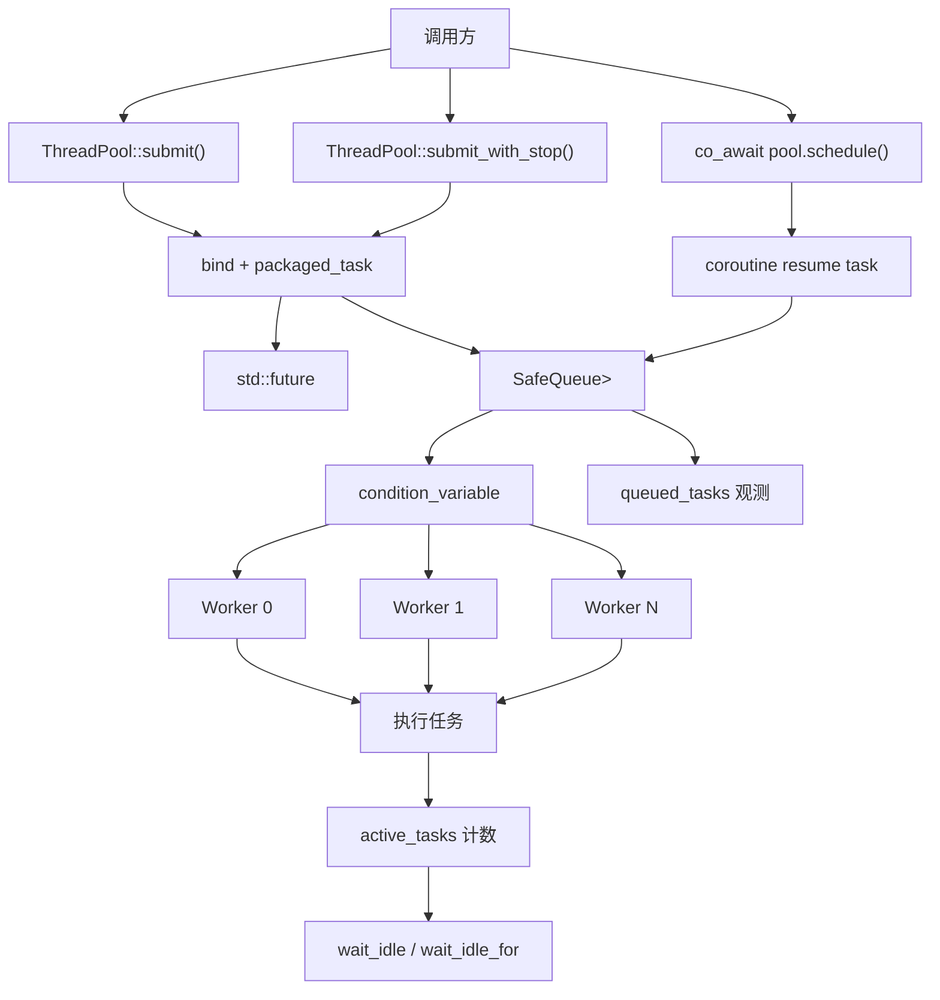
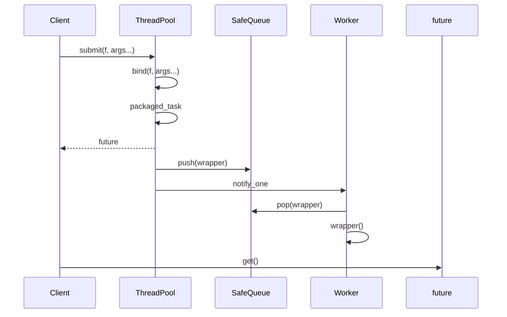
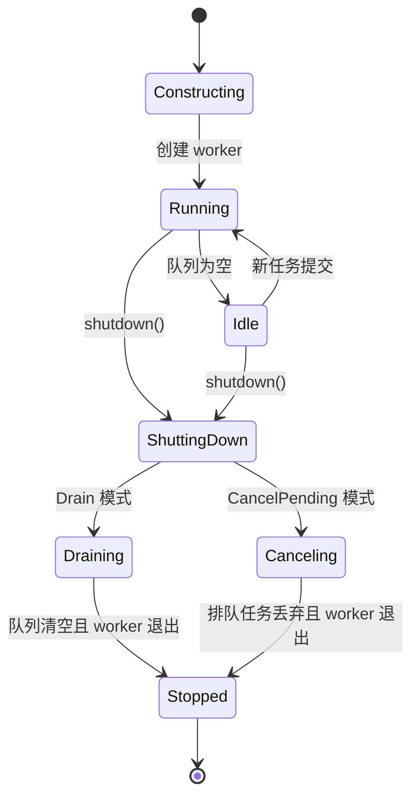
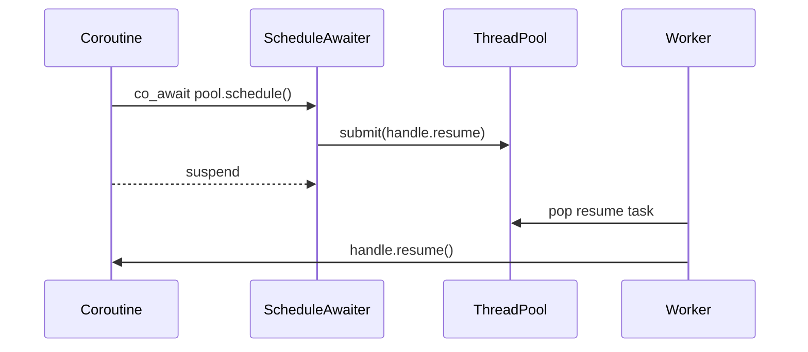

# ThreadPool 详细设计说明

本文档说明当前线程池项目的设计思想、任务调度策略、生命周期管理、协程支持、优点与缺点，以及它距离完整生产级线程池还缺少什么。

## 设计目标

这个项目的目标不是做一个功能最复杂的线程池，而是实现一个结构清晰、可测试、可扩展的小型 C++ 并发组件。

核心目标：

- 使用固定数量 worker 线程复用系统线程资源。
- 支持普通函数、lambda、成员函数和带返回值任务。
- 使用 `std::future` 把异步任务结果返回给调用方。
- 支持优雅关闭和取消尚未执行的排队任务。
- 支持等待线程池空闲，方便测试和业务同步。
- 支持 C++20 协程调度到线程池执行。
- 保持 C++14 基础接口可用，同时在 C++20 下启用协程能力。

## 总体架构



主要组件：

- `threadpool::ThreadPool`：线程池主体，负责 worker 创建、任务提交、关闭、状态查询。
- `threadpool::SafeQueue<T>`：线程安全队列，保存待执行任务。
- `Worker`：内部工作线程对象，循环等待、取任务、执行任务。
- `StopSource` / `StopToken`：协作式取消机制。
- `ScheduleAwaiter`：C++20 协程调度器入口。

## 任务模型

线程池内部队列只保存一种任务类型：

```cpp
std::function<void()>
```

但调用方可以提交各种形式的任务：

```cpp
pool.submit(add, 1, 2);
pool.submit([] { return 42; });
pool.submit(&Calculator::multiply, &calc, 3, 4);
```

`submit()` 会把这些不同形式统一转换成 `std::function<void()>`。

转换过程：

1. `std::result_of` 推导任务返回类型。
2. `std::bind` 绑定函数和参数，得到无参函数对象。
3. `std::packaged_task<return_type()>` 包装任务。
4. `packaged_task::get_future()` 返回结果通道。
5. 把 `packaged_task` 包进 `std::function<void()>`。
6. 任务入队，并唤醒一个 worker。



这种设计的好处是 worker 不需要知道任务的真实类型、参数列表和返回值类型。worker 只负责执行 `void()`。

## 调度策略

当前线程池使用的是固定线程数、共享 FIFO 队列、条件变量唤醒的调度策略。

### 固定线程数

线程池构造时创建固定数量 worker：

```cpp
threadpool::ThreadPool pool(4);
```

worker 数量不能为 0，否则构造函数抛出 `std::invalid_argument`。

固定线程数的特点：

- 实现简单。
- 线程数量稳定，不会在高峰期无限增长。
- 适合 CPU 密集型任务或可控后台任务。
- 不支持根据负载动态扩缩容。

### 共享 FIFO 队列

所有任务进入同一个 `SafeQueue<std::function<void()>>`。

worker 被唤醒后从队列头部取任务执行，因此整体上接近 FIFO。

注意：由于多线程并发执行，任务“开始执行”的顺序接近提交顺序，但任务“完成”的顺序不保证一致。耗时短的任务可能比先提交的长任务更早完成。

### 条件变量唤醒

当队列为空时，worker 使用 `condition_variable::wait(lock, predicate)` 休眠。

predicate 是：

```cpp
m_shutdown || !m_queue.empty()
```

这样可以处理两类事件：

- 有新任务入队。
- 线程池进入关闭流程。

使用 predicate 的原因：

- 避免虚假唤醒导致 worker 空转。
- 避免通知丢失后 worker 永久睡眠。
- 让关闭状态和任务状态在同一套等待条件中统一处理。

### 唤醒策略

提交一个任务后调用：

```cpp
m_conditional_lock.notify_one();
```

这表示每次新任务只唤醒一个 worker。这样可以减少无意义唤醒，适合常规任务提交。

关闭线程池时调用：

```cpp
m_conditional_lock.notify_all();
```

因为所有 worker 都需要醒来检查关闭状态并退出。

## 生命周期策略

线程池生命周期分为四个阶段：



### 自动启动

构造函数会自动调用 `init()`：

```cpp
threadpool::ThreadPool pool(4);
```

调用方不需要手动启动线程。`init()` 仍保留，并且是幂等的，多次调用不会重复创建 worker。

### 自动关闭

析构函数会调用 `shutdown()`：

```cpp
~ThreadPool() noexcept;
```

这样可以避免调用方忘记关闭线程池时触发 `std::terminate`。

### 关闭模式

当前支持两种关闭模式。

#### Drain

默认模式：

```cpp
pool.shutdown();
```

语义：

- 停止接收新任务。
- 已经提交的任务继续执行。
- 队列排空后 worker 退出。
- 调用方等待所有 worker join。

适合希望不丢任务的场景。

#### CancelPending

立即取消排队任务：

```cpp
pool.shutdown(threadpool::ThreadPool::ShutdownMode::CancelPending);
```

语义：

- 停止接收新任务。
- 清空还没开始执行的排队任务。
- 已经开始执行的任务继续运行到结束。
- 被清空任务对应的 `future.get()` 会抛 `std::future_error`。

适合程序退出、用户取消批量作业、服务降级等场景。

## 等待空闲策略

线程池维护两个状态：

- `queued_tasks()`：队列中尚未开始执行的任务数。
- `active_tasks()`：worker 已经取出、正在执行的任务数。

当满足下面条件时，线程池视为空闲：

```text
queued_tasks == 0 && active_tasks == 0
```

可以使用：

```cpp
pool.wait_idle();
pool.wait_idle_for(std::chrono::seconds(1));
pool.wait_idle_until(deadline);
```

这些接口适合：

- 单元测试等待后台任务完成。
- 应用退出前等待后台任务收尾。
- 批处理阶段之间做同步。

## 协作式取消策略

C++ 不能安全地强制终止任意正在运行的线程。强杀线程可能导致锁没有释放、对象析构不完整、共享状态损坏。

因此项目采用协作式取消：

```cpp
threadpool::ThreadPool::StopSource stop_source;

auto future = pool.submit_with_stop(
	stop_source.token(),
	[](threadpool::ThreadPool::StopToken token) {
		while (!token.stop_requested()) {
			do_work_chunk();
		}
	}
);

stop_source.request_stop();
```

特点：

- `StopSource` 发出取消请求。
- `StopToken` 被传入任务。
- 任务自己定期检查 `stop_requested()`。
- 任务决定何时安全退出。

这是一种更安全、也更符合 C++ 资源管理模型的取消方式。

## 协程调度策略

C++20 协程本身只提供挂起和恢复机制，不提供线程池或事件循环。

本项目提供：

```cpp
co_await pool.schedule();
```

其含义是：

1. 当前协程挂起。
2. `ScheduleAwaiter::await_suspend()` 得到 `std::coroutine_handle<>`。
3. 把 `handle.resume()` 封装成普通线程池任务。
4. worker 执行该任务。
5. 协程从 `co_await` 后的位置继续运行。



这个设计不是重新实现协程，而是利用标准协程机制，补上“在哪里恢复执行”的调度策略。

当前协程支持仍然是轻量级的，只支持调度恢复，不提供完整 `Task<T>` 异步组合模型。

## 线程安全设计

项目中的关键共享状态包括：

- 任务队列。
- shutdown 状态。
- started 状态。
- active task 计数。
- worker 线程数组。

保护策略：

- `SafeQueue` 内部使用自己的 mutex 保护队列。
- `ThreadPool` 使用 `m_conditional_mutex` 保护关闭状态、启动状态和 active task 计数。
- worker 等待使用 `condition_variable` predicate。
- 任务提交时在锁内检查 `m_shutdown`，避免关闭后继续入队。

需要注意的是，当前实现中队列有自己的锁，线程池也有自己的条件变量锁。这让队列可以独立复用，但也比“队列和条件变量共用一把锁”的实现稍复杂。

## 优点

### 1. 接口简单

最常用接口只有：

```cpp
auto future = pool.submit(task, args...);
```

调用方容易理解。

### 2. 支持返回值和异常传播

通过 `std::packaged_task` 和 `std::future`，任务返回值和异常都能传回调用方。

### 3. 生命周期更安全

构造后自动启动，析构时自动关闭，减少误用成本。

### 4. 支持两种关闭语义

`Drain` 适合不丢任务，`CancelPending` 适合快速退出。

### 5. 支持可观测状态

`queued_tasks()`、`active_tasks()`、`wait_idle()` 让测试和业务同步更容易。

### 6. 支持 C++20 协程调度

可以把协程恢复到线程池 worker 上，方便编写异步流程。

### 7. 有基础测试和压力测试

项目包含：

- 行为测试。
- 协程测试。
- 压力测试。

比单纯 demo 更接近可维护组件。

## 缺点与限制

### 1. 没有任务优先级

所有任务都进入同一个 FIFO 队列。紧急任务不能插队。

适合普通后台任务，不适合实时性要求高的调度系统。

### 2. 没有动态扩缩容

worker 数量构造后固定。

如果负载变化很大，固定线程数可能不够灵活。

### 3. 没有 work stealing

所有 worker 共享一个队列。高并发下队列锁可能成为瓶颈。

更复杂的线程池可能会使用每线程本地队列和 work stealing 策略。

### 4. 取消是协作式的

`StopToken` 只能通知任务退出，不能强制停止任务。

如果任务不检查 token，就不会响应取消。

### 5. `CancelPending` 会让 future 变成 broken promise

排队任务被清空后，其 `packaged_task` 不会执行，对应 `future.get()` 会抛 `std::future_error`。

这是合理行为，但调用方必须知道并处理。

### 6. 协程支持还很轻量

当前只有 `schedule()`，没有：

- `Task<T>`
- 协程返回值组合
- continuation
- cancellation-aware awaiter
- structured concurrency

### 7. 没有系统级 benchmark

目前有压力测试，但还没有严格 benchmark，例如：

- 不同任务粒度下吞吐量。
- 不同 worker 数下延迟。
- 和 `std::async` 或其他线程池对比。
- 长时间 soak test。

## 适合场景

适合：

- 学习 C++ 并发和线程池原理。
- 小型工具的后台任务执行。
- CPU 密集型批处理。
- 测试环境中的异步任务调度。
- 需要 `future` 返回值的简单并行任务。
- 演示 C++20 协程如何切换到线程池执行。

不适合：

- 高实时性任务调度。
- 复杂优先级调度。
- 极高吞吐的低延迟服务核心路径。
- 需要强制取消任务的场景。
- 完整异步 runtime 或事件循环替代品。

## 后续演进方向

如果继续向生产级推进，可以考虑：

1. 增加优先级任务队列。
2. 引入每 worker 本地队列和 work stealing。
3. 增加任务超时包装器。
4. 增加动态扩缩容。
5. 设计完整 `Task<T>` 协程返回模型。
6. 增加 benchmark 和长时间稳定性测试。
7. 增加 CI，覆盖 Windows、Linux、不同编译器。
8. 增加安装导出规则，让项目可以被 `find_package` 使用。
